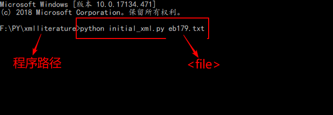

# 环境
1. `python3`
2. package: `pandas`, `requests`

# 流程

1. 准备文本文件file（从 webofscience 核心数据库，plaintext下载）

2. 进入命令行当前路径

3. 执行如下命令初始化`lite.xml`, 以及`xlsx` 文件

   ` python initial_xml.py <file> <title> `

4. 修改xlsx文件（根据标题，关键字手动设置某篇文章可见以及其他）

5. 修改规则 

   * 排序使用大于0小于10的数
   * 不可见设为小于等于0即可
   * 图片名和图片文件名对应，多个名字应用英文分号 ;隔开,分号后应留有空格

6. 执行如下命令使修改生效，并生成摘要文稿

   `python change_xml.py <file>`

7. 可重复执行5，6步

8. 上传，需要上传相应的图片和lite.xml文件

   上传网址：[http://119.23.107.86/others/fileupload.html](http://119.23.107.86/others/fileupload.html)
   

9. 结果查看

   查看地址：`http://119.23.107.86/others/<yourname>/journalread.php`

# 示例
1. 从webofscience获取文本文件

2. 命令行执行

3. 结果示例

	示例：[http://119.23.107.86/others/zhangsan/journalread.php](http://119.23.107.86/others/zhangsan/journalread.php)

